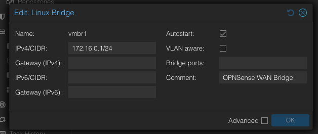
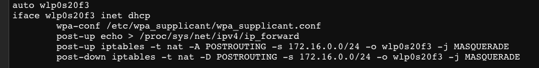

## 4. OPNsense Deployment & VLAN Setup
    
### 4.1 Linux Bridge Setup for WAN & LAN interfaces

Since OPNsense is based on FreeBSD that does not play well with Wi-Fi drivers, we need to set a "virtual wire" to send Proxmox's Wi-Fi internet to OPNsense as our WAN. Explanation can be found in [Techinal Security Decisions](2-Technical-Security-Decisions.md#21-wi-fi-as-nat):

   - In the Proxmox Web GUI, go to System > Network
     
       
   - Create a new Linux Bridge `vmbr1`:
       - Assign `172.16.0.1/24` IPv4 [^1]
       - Check the Autostart checkbox
       - Put a descriptive comment
    
   - For `vmbr0` be sure that VLAN aware checkbox is checked

   - Next we have to route the Wi-Fi traffic to `vmbr1` by adding these NAT rules under the Wi-Fi interface in `/etc/network/interfaces`:
       ```bash
          post-up echo > /proc/sys/net/ipv4/ip_forward
          post-up iptables -t nat -A POSTROUTING -s 172.16.0.0/24 -o [interface] -j MASQUERADE
          post-down iptables -t nat -D POSTROUTING -s 172.16.0.0/24 -o [interface] -j MASQUERADE
       ```
       e.g.:
     
       

### 4.2 Creating OPNsense VM in Proxmox:
   - Login to Proxmox and create a new VM with the following configurations:
     
     - 20GB SCSI disk (OPNsense dont require large disk space)
     - 2 CPU Core
     - 4GB RAM recommended but 2GB is okay for now
     - No network device for now
    
   - Next we will add both our WAN & LAN network device in VM > Hardware:

     - First we add `net0` pointing to `vmbr0` as our LAN
     - Secondly, we add `net01` pointing to `vmbr1` as our WAN

  >[!IMPORTANT]
  >The network device arrangement is important as first network device will always be configured as LAN by OPNsense.
     
### 3.2 Getting Temporary Internet Access:
  > [!TIP]
  > This step is optional and can be replaced with copying the `wpa supplicant` package and its dependencies to a USB drive and mount it in Proxmox to install it.
   - Since my host machine is connected to my Mercusys router that do not have internet access, i need to use USB Tethering from my phone to get temporary internet access.
   - After turning on the USB Tethering, plug in the phone to the host machine.
   - Then run `ip a` to list out all network interfaces:
   
      
   
     Take note of the network interface name of the USB Tethering device. In my case it is `enxaedde6bf213a`
   - Start the interface and obtain the ip address:
       ```bash
          ip link set <interface> up
          dhclient <interface>
       ```

[^1]: I use `172.16.0.x` range for `vmbr1` to avoid confusion with my home networks
