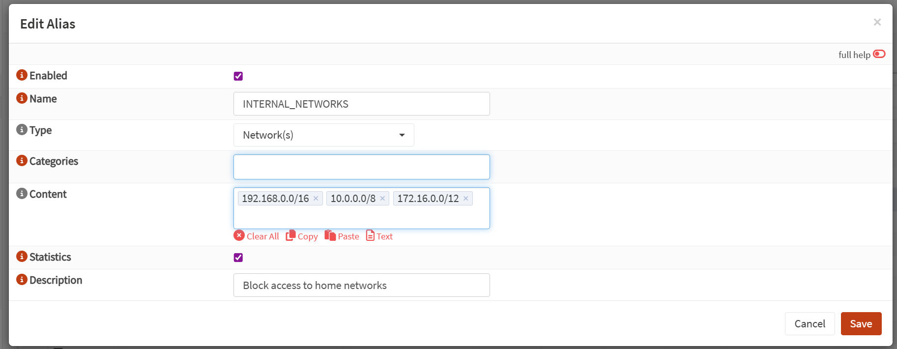
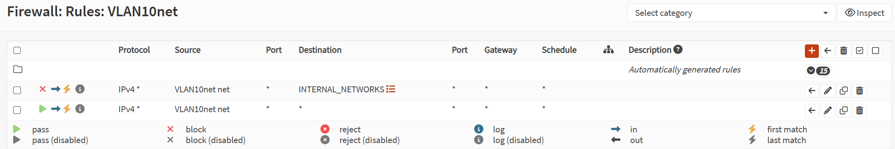
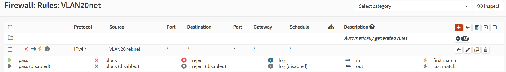

## 5. Initial Firewall Setup

>[!WARNING]
>Be sure to configure this initial firewall rules. Just in case our VMs is compromised, it cannot access our management network and home network.

### 5.1 Alias Definition

   - To make our life easier and more organized, we can create an alias for our internal home networks containing all of our internal IP address that we dont want the VMs to access
   - To do so we can login to OPNsense Web GUI and go to **Firewall > Aliases**
   - Then we can add a new alias containing `192.168.0.0/16` (Our home network), `172.16.0.0/12` (Our WAN NAT), and `10.0.0.0/8`:
       

Next we will configure the initial firewall rules for our VLANs

### 5.2 Offensive Rules in VLAN 10
   

   - **Block:** (Prevent lab machine from accessing internal networks)
        - Source: `VLAN 10 net`
        - Destination: `INTERNAL_NETWORKS`

   - **Pass:** (Allows internet)
        - Source: `VLAN 10 net`
        - Destination: `Any`
    
### 5.3 Defensive Rules in VLAN 20
    
   
   - **Block:** (Sandboxing for safer practice)
        - Source: `VLAN 20 net`
        - Destination: `Any`
>[!TIP]
>Later if VLAN 20 need internet connection, just disable this rule safely.
    
